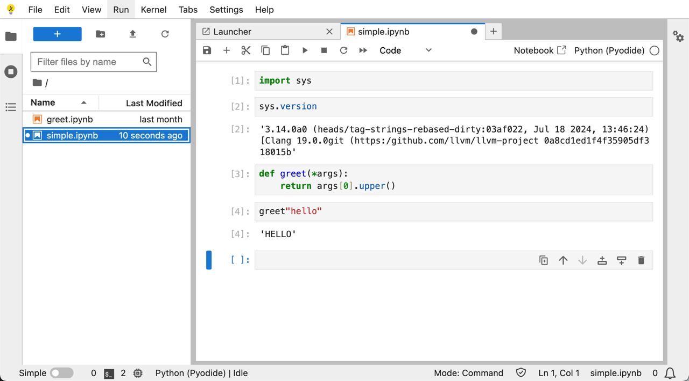

The Project provides playground for tagged strings feature of Python 3.12.0a7. (the branch is [tag-strings-v2](https://github.com/gvanrossum/cpython/tree/tag-strings-v2))

## Try tagged strings on jupyterlite (no installation needed)
 
https://koxudaxi.github.io/tagstr-playground/

](https://raw.githubusercontent.com/koxudaxi/tagstr-playground/main/docs/images/simple.png)

## Contents

The `/pyodide` directory has pyodide binary of Python 3.12.0a7([tag-strings-v2](https://github.com/gvanrossum/cpython/tree/tag-strings-v2)).

The pyodide binary is build by [a fork](https://github.com/koxudaxi/pyodide/tree/tag-strings-v2) of the [hoodmance's python-3.12.0b2 branch](https://github.com/hoodmane/pyodide/compare/python-3.12.0b2).([diff](https://github.com/hoodmane/pyodide/compare/python-3.12.0b2...koxudaxi:pyodide:tag-strings-v2))

# Related projects
- https://github.com/jimbaker/tagstr
- https://github.com/pauleveritt/fdom
